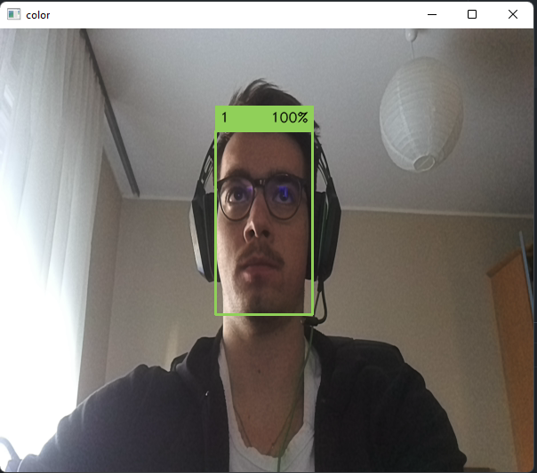
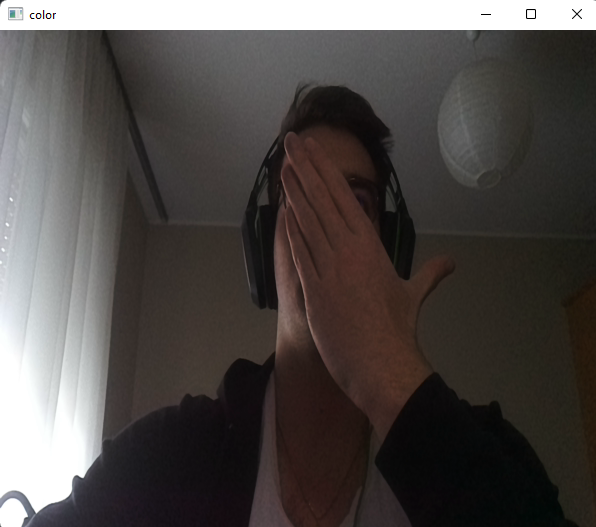

======================
Blob and Nnet managers
======================

Blob manager
------------

``Blob manager`` is a class that is made to help you with downloading neural networks as MyriadX blobs.

Getting started
^^^^^^^^^^^^^^^

``Blob manager`` is very easy and straight forward to use. We declare it and pass which project we want to use as it's argument.

.. literalinclude:: ./examples/code_fractions/blob.py
   :language: python
   :linenos:

After that, the ``blob`` is stored in our variable and we can then pass it to our ``Nnet manager``, as we will se bellow.
Of course the ``face-detection-retail-0004`` is not the only project that we can use. All other projects that are supported are:

.. include::  blob_projects.rst

Nnet manager
------------

``Blob manager`` is a class that is made to help you with setting up neural networks.

Getting started
^^^^^^^^^^^^^^^

As the ``Blob manager`` and ``Nnet manager`` work together, we will need both to use our neural network. We will also need to use the ``Pipeline manager`` and the ``Preview manager`` to make everything work together.

``Pipeline manager`` will define our stream sources from our OAK camera,

``Preview manager`` will show us our frames (to see what is happening),

``Blob manager`` will download and store our blob file,

and ``Nnet manager`` will start and run our neural network.

Face detection
^^^^^^^^^^^^^^

.. literalinclude:: ./examples/face_detection_color.py
   :language: python
   :linenos:

In this above example we will use all above mentioned classes and run the face detection project.
First we define the pipeline and initialize the streams. After that we load in our blob (``face-detection-retail-0004``) and send it in to our ``Nnet manager``.
Every project has its own ``inputSize`` and ``familyName``. To see more about the different requirements check the ``depthai/resources/nn`` folder. Every blob has its requirements in it's json file.
After all that is initialized, we add our neural network to our pipeline and connect to our device. In our device we set our ``Previews``, to see our stream and create our stream queues.
Like every other class that we covered, we need a loop, that will keep our project running, and in our loop, we get our frames, use our neural network to write over our frames, and then we show them on the stream.

Outputs of our above program should look like this:

If our face is shown, our neural network detects it, but if we cover it, our neural network will not detect it.

Mobile net
^^^^^^^^^^

.. literalinclude:: ./examples/mobile_net_ssd.py
   :language: python
   :linenos:

This example shows how to use the ``mobile net`` project. The code should be almost the same as the one that we used in the above example, with the only difference beeing
the blob. In this example we load the ``mobilenet-ssd`` blob and pass it to our neural network.

If you wish to learn more about ``Blob manager`` or ``Nnet manager`` check ``API``.

.. include::  footer-short.rst